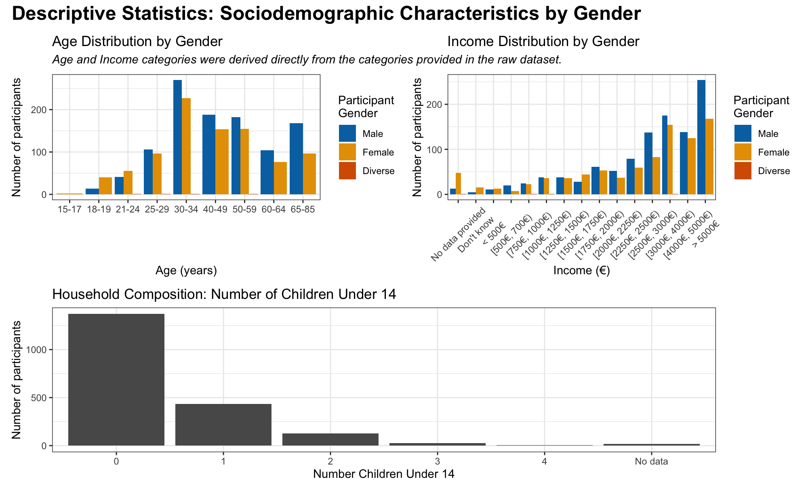
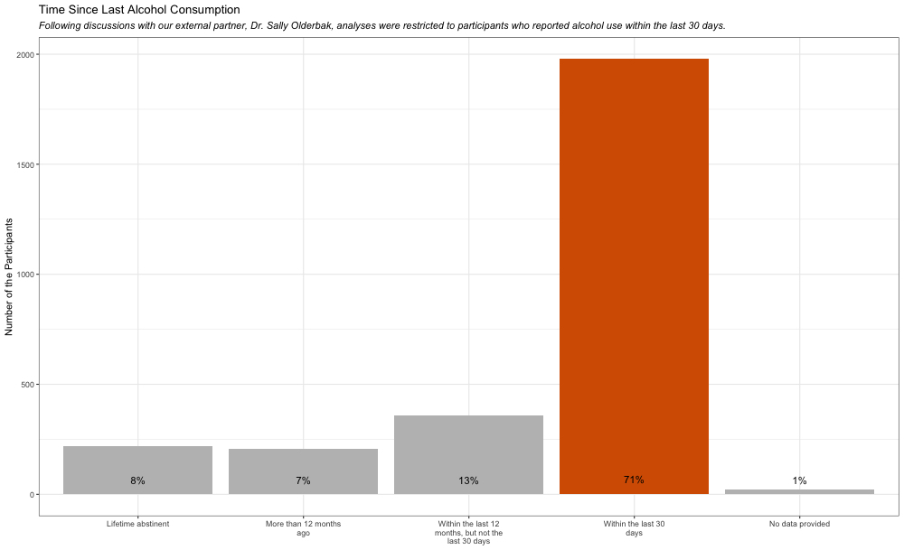
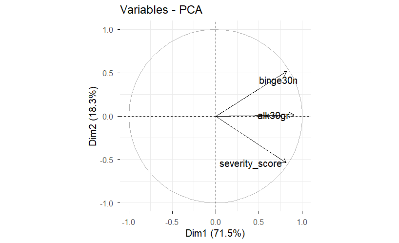
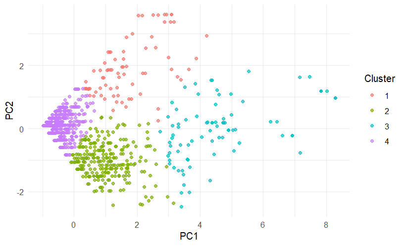
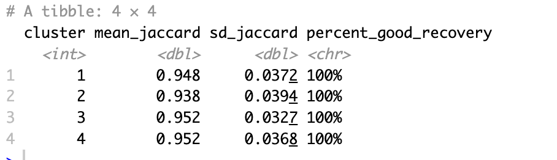

```{r}
library(ggplot2)
library(tidyverse)
library(dplyr)
library(haven)
library(cluster)
library(patchwork)
```


## Agenda

-   **Introduction**
-   **Descriptive Statistics (1): Sociodemographic Overview**
-   **Descriptive Statistics (2): Time Since Last Alcohol Consumption**
-   **Data Pre-Processing and Variable Selection**
-   **Methodology**
-   **PCA Analysis**
-   **Identifying and Validating Cluster Amount**
-   **Hypothesis Testing**


## Introduction (1)

- [Data Source]{style="color:#006400; font-weight:bold;"}:
    - German health & substance-use survey: 
        - Sub-sample from the [Epidemiologischer Suchtsurvey (ESA) 2024]{style="color:#006400; font-weight:bold;"}
      conducted by IFT Institut für Therapieforschung and Ipsos GmbH on behalf of the BMG
    - Nationwide standardized study:
        - Focus on alcohol, tobacco, medications, and illicit drug use in Germany
    - Study design:
        - Cross-sectional design,
        - Voluntary participation, 
        - Standardized questionnaire, 
        - GDPR-compliant data collection   
    - Sample characteristics:
        - Online survey with [2,784 respondents]{style="color:#006400; font-weight:bold;"} (aged [16–85 years]{style="color:#006400; font-weight:bold;"}) covering diverse sociodemographic groups


## Introduction (2)

- [Why Identifying Alcohol Consumer Types ?]{style="color:#006400; font-weight:bold;"}

    - To identify [distinct patterns of alcohol use]{style="color:#006400; font-weight:bold;"} and associated [risk profiles]{style="color:#006400; font-weight:bold;"}
    - To support targeted [public health interventions]{style="color:#006400; font-weight:bold;"}
    - To distinguish groups with [different motivations and consumption behaviors]{style="color:#006400; font-weight:bold;"}
    - To enable better policy decisions on [prevention, taxation, and education]{style="color:#006400; font-weight:bold;"}

- [Project Objectives]{style="color:#006400; font-weight:bold;"}

    1. [Identify distinct alcohol consumption profiles]{style="color:#006400;font-weight:bold;"} in German survey data using a [PCA-based clustering approach]{style="color:#006400; font-weight:bold;"}? 

    2. [Examine differences between profiles]{style="color:#006400; font-weight:bold;"} with respect to:
    - age, gender, drink frequency, other relevant characteristics
    

    3. [Assess the prevalence of each profile]{style="color:#006400; font-weight:bold;"} and how they differ in:
    - consumption intensity
    - alcohol-related risk factors


##

::: {.text-center}
{width=100%}
:::

## 

::: {.text-center}
{width=100%}
:::


## Data Pre-Processing and Variable Selection (1)
- [Alcohol-Related Variables]{style="color:#006400; font-weight:bold;"}:
    - Comprehensive set of [101 alcohol-related variables]{style="color:#006400; font-weight:bold;"}
    - Coverage across [recency, quantity, frequency, and risk patterns]{style="color:#006400; font-weight:bold;"}
    - Multiple measurement scales (glasses, grams, liters; short- and long-term)
    - Examples of captured dimensions:
        - Timing of last alcohol consumption (30 days / 12 months / ever)
        - Beverage types (beer, wine, spirits, mixed drinks)
        - Consumption volume (weekly, monthly, yearly; standardized to grams)
        - Risk indicators (risky drinking, binge drinking)
        - DSM-based problem indicators (binary)

        
## Data Pre-Processing and Variable Selection (2)   

- [Variable Selection for Clustering]{style="color:#006400; font-weight:bold;"}:
    - Variables Used for Clustering: 
        - Consumption quantity
        - DSM symptom indicators (binary)
        - Binge-drinking days (30-day standardized)
        - Severity score (alcohol-related consequences, e.g., police incidents, health or social problems)
    - Sociodemographic Variables for Post-Class Comparison:
        - Age
        - Gender
        - Income
        - Education

## Data Pre-Processing and Variable Selection (3)

- [Handling Missing Data (MAR)]{style="color:#006400; font-weight:bold;"}:
    - [What is Missing At Random (MAR)?]{style="color:#006400; font-weight:bold;"}
        - Missingness depends on [observed variables]{style="color:#006400; font-weight:bold;"}, not on the unobserved value itself.
        - MAR is compatible with [model-based imputation approaches]{style="color:#006400; font-weight:bold;"}.
    - [How We Handled MAR in Our Analysis]{style="color:#006400; font-weight:bold;"}  
        - Missing values were imputed using Principal Component Analysis (PCA):
        - ```imp <- imputePCA(X, ncp = 2, scale = TRUE) ```
    - [How PCA Imputation Works]{style="color:#006400; font-weight:bold;"}  
        - PCA identifies the [main latent structure]{style="color:#006400; font-weight:bold;"} in the observed data
        - Missing values are estimated using [low-dimensional projections]{style="color:#006400; font-weight:bold;"} 
        - Each missing entry is replaced by a value [consistent with global data patterns]{style="color:#006400; font-weight:bold;"} 
        - Variables are [scaled]{style="color:#006400; font-weight:bold;"} to ensure equal contribution

## Data Pre-Processing and Variable Selection (4)

- [Severity Score Construction and Missing Data Handling]{style="color:#006400; font-weight:bold;"}:
    - [Severity score]{style="color:#006400; font-weight:bold;"} was computed using only [answered items]{style="color:#006400; font-weight:bold;"},
adjusting for varying response completeness.
        - $$\text{Severity} =\frac{\text{Yes responses}}{\text{Answered items}}\times \log(1 + \text{Answered items})$$
    - [How Missing Data Is Handled]{style="color:#006400; font-weight:bold;"}
        - Unanswered items are [excluded from the denominator]{style="color:#006400; font-weight:bold;"}
        - Score is [normalized by response availability]{style="color:#006400; font-weight:bold;"}
        - Log-weighting reduces instability for low response counts
    - [Why This Approach Was Used]{style="color:#006400; font-weight:bold;"}
        - Avoids artificial inflation from missing DSM items
        - Preserves comparability across respondents
        

## Methodology (1)

- [What is Principal Component Analysis (PCA)?]{style="color:#006400; font-weight:bold;"}  

    - [Dimensionality reduction technique]{style="color:#006400; font-weight:bold;"}
    
    - Transforms correlated variables into a smaller set of [uncorrelated components]{style="color:#006400; font-weight:bold;"}
    
    - Each component is a [linear combination]{style="color:#006400; font-weight:bold;"} of the variables ordered by [explained variance]{style="color:#006400; font-weight:bold;"}.

    - Used as a [preprocessing step ]{style="color:#006400; font-weight:bold;"} before clustering.
    
- [Clustering Method: K-Means]{style="color:#006400; font-weight:bold;"}:

    - [Partitioning algorithm]{style="color:#006400; font-weight:bold;"} that divides observations into [K clusters]{style="color:#006400; font-weight:bold;"} 
    - Minimizes [within-cluster variance]{style="color:#006400; font-weight:bold;"}
    - Operates in a [continuous Euclidean space]{style="color:#006400; font-weight:bold;"}
    - K-means represents each cluster by its [centroid (mean of points)]{style="color:#006400; font-weight:bold;"} rather than an actual observation.
    
    
    

    
## Methodology (2)

- [Structure of the PCA]{style="color:#006400; font-weight:bold;"}:
    - [Covariance (or correlation) matrix]{style="color:#006400; font-weight:bold;"}: PCA is based on the covariance (or correlation) structure of the data.
    - [Eigenvalues]{style="color:#006400; font-weight:bold;"}: Indicate how much variance is explained by each principal component.
    - [Eigenvectors (loadings)]{style="color:#006400; font-weight:bold;"}: Define the direction of each principal component in the original variable space.
    - [Principal Components]{style="color:#006400; font-weight:bold;"}:
        - PC1 captures the largest possible variance.
        - PC2 captures the largest remaining variance, orthogonal to PC1.
    
- [Key Assumptions]{style="color:#006400; font-weight:bold;"}:
    - Linear relationships between variables.
    - Variables are measured on comparable scales (or standardized)
    - Directions of high variance are assumed to be informative.


## Methodology (3)

- [Why PCA before K-means?]{style="color:#006400; font-weight:bold;"}

    - PCA produces [orthogonal, scaled components]{style="color:#006400; font-weight:bold;"}
    - This creates a [well-behaved Euclidean space]{style="color:#006400; font-weight:bold;"}

- [K-means Optimization]{style="color:#006400; font-weight:bold;"}:

    - Similarity is measured using [Euclidean distance]{style="color:#006400; font-weight:bold;"}
    - K-means assigns observations to K clusters
    - The objective of K-means is to minimize the [within-cluster variability]{style="color:#006400; font-weight:bold;"}:
        - $$\sum_{k=1}^{K} \sum_{i \in C_k} \| x_i - \mu_k \|^2$$
        - where: $C_k$is cluster $k$ and $\mu_k$ is the centroid of cluster $k$


## PCA Analysis (1)

::: {.text-center}
{width=80%}
:::

## PCA Analysis (2)

::: {.text-center}
{width=80%}
:::


## Identifying and Validating Cluster Amount (1)

- [Choosing the Number of Clusters:]{style="color:#006400; font-weight:bold;"}:
    - Silhouette Analysis:
        - Cluster solutions (k = 2–10) were evaluated using the [average silhouette score]{style="color:#006400; font-weight:bold;"}.
        - The silhouette score measures how well observations are matched to their own cluster compared to other clusters.
        - Higher values indicate better [cluster separation and cohesion]{style="color:#006400; font-weight:bold;"}.
    - [Results]{style="color:#006400; font-weight:bold;"}:
        - {width=30%} | {width=30%}
       
        
        
## Identifying and Validating Cluster Amount (2) 

- [Cluster Stability]{style="color:#006400; font-weight:bold;"}:
    - [Cluster Stability (Bootstrap Jaccard)]{style="color:#006400; font-weight:bold;"}:
        - Cluster stability was assessed using [bootstrap resampling]{style="color:#006400; font-weight:bold;"} and the [Jaccard similarity index]{style="color:#006400; font-weight:bold;"}.
        - The Jaccard index measures how consistently cluster memberships are recovered.
    - [Results]{style="color:#006400; font-weight:bold;"}:
        - {width=50%}
    - [Interpretation]{style="color:#006400; font-weight:bold;"}:
        - The clustering solution shows [high stability]{style="color:#006400; font-weight:bold;"} and is [robust]{style="color:#006400; font-weight:bold;"} to data perturbations.
        - This supports the [reliability of the chosen number of clusters]{style="color:#006400; font-weight:bold;"}.

## Hypothesis Testing (1)

- [Post-Cluster Hypothesis Testing]{style="color:#006400; font-weight:bold;"}:
    - [Chi-Squared Tests]{style="color:#006400; font-weight:bold;"}:
        - Associations between [cluster membership]{style="color:#006400; font-weight:bold;"} and [categorical variables]{style="color:#006400; font-weight:bold;"} were tested using [Pearson’s chi-squared test]{style="color:#006400; font-weight:bold;"}.
        - The test evaluates whether the [observed distribution across clusters]{style="color:#006400; font-weight:bold;"} differs from what would be expected under independence.
    - [Multiple Testing Adjustment (Holm’s Method)]{style="color:#006400; font-weight:bold;"}:
        - Multiple hypothesis tests were conducted across variables.
        - To control the [family-wise error rate]{style="color:#006400; font-weight:bold;"}, p-values were adjusted using [Holm’s correction]{style="color:#006400; font-weight:bold;"}.
        - Holm’s method is less conservative than Bonferroni and also more powerful while maintaining strong error control
    - [Interpretation]{style="color:#006400; font-weight:bold;"}:
        - Only associations remaining significant after Holm adjustment were considered robust.
        - This ensures results are not driven by chance due to multiple comparisons.
        
## Hypothesis Testing (2)
::: { .columns }

:::: { .column width="50%" }
<!-- Left column content -->
::::

:::: { .column width="50%" }
<!-- Right column content -->
::::

:::


## Hypothesis Testing (3)
::: { .columns }

:::: { .column width="50%" }
<!-- Left column content -->
::::

:::: { .column width="50%" }
<!-- Right column content -->
::::

:::


## Hypothesis Testing (4)
::: { .columns }

:::: { .column width="50%" }
<!-- Left column content -->
::::

:::: { .column width="50%" }
<!-- Right column content -->
::::

:::


## Hypothesis Testing (5)
::: { .columns }

:::: { .column width="50%" }
<!-- Left column content -->
::::

:::: { .column width="50%" }
<!-- Right column content -->
::::

:::


